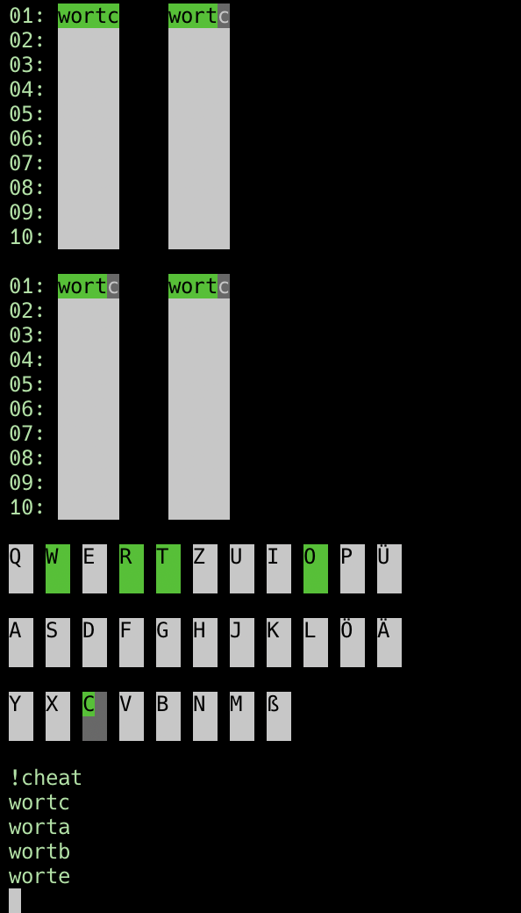

# Review für Hugo
Autorin: Angelina Lorenz  
Datum: 06.09.2023  
Python-Version: 3.11.4  
Betriebssystem: macOS

#### Anmerkungen zur Review:  
Diese Review ist unterteilt in zwei Abschnitte: dem [*Playtesting*](#playtesting) und der Codekritik. Im erstgenannten Abschnitt schildere ich meine Erfahrungen als vollkommen naive Testperson (mit minimalem Wissen über den Inhalt der verschiedenen Codedateien) und Letztere ist als Zeilenkommentare im Code zu finden. Die Reihenfolge der Kritikpunkte entspricht dabei der Reihenfolge, wie sie mir aufgefallen sind.  

Meine Vorgehensweise beim Testen war dabei die folgende:  
- Kopieren des Repositorys und Erstellen eines vollkommen leeren Conda-Environments 
- Ausführen von ```data_install.py```
- Ausführen von ```main.py``` mit verschiedenen Argumenten
- Blick in den Code

#### Playtesting
**Allgemeine Anmerkungen:**  
- 👍 README: Sehr gut, dass sowohl ein automatischer sowie ein manueller Installationsweg beschrieben sind  
- 👎 Unterordner für die verschiedenen Dateien wäre schön, denn die wirken auf den ersten Blick echt erschlagend

**Dateninstallation:**
- ❗️ Bitte Angabe ins README, dass ```requests``` installiert werden muss
- 👍 Ansonsten läuft alles einwandfrei  

**Main:**
- ❗️ Bitte Angabe ins README, dass ```colorama``` installiert werden muss
- 🤔 Vielleicht wäre Feedback gut, warum ein Eingabewort nicht gültig ist: Meine allererste Eingabe war 'raben' und ich war confused, warum das nicht funktionierte 
- 👍 Chef's Kiss dafür, dass du eine funktionierende Keyboardanzeige eingebaut hast, obwohl die nicht obligatorisch ist  
- 👎 An den Argumenten für den Spielstart muss zum Teil noch gefeilt werden. Hier ein paar Beispiele:
    - ```python main.py -s -z <path_to_text>/test.txt```: Das Spiel konnte gestartet werden, aber bei der Eingabe 'katze' (ist in test.txt enthalten) kam es zu folgendem Error: ```IndexError: string index out of range```  
      Der Bug konnte auch bei Wiederholung und mit einem anderen Ratewort reproduziert werden
    - ```-r```als Option ist zwar ganz nett und funktioniert auch, aber wenn man es allein verwendet, ohne, dass auch die Zielwörter angepasst werden, macht es bei einer kleinen Ratewortliste das Gewinnen des Spiels unmöglich. Dazu kommt, dass in diesem Fall die Beschränkung, kein Wort doppelt eingeben zu können, dafür sorgt, dass das Spiel nicht beendet werden kann. (Ja, das ist mir passiert 😂)  
    - Ich habe das Spiel mit ```-f <path_to_repo>/quordle_CLI``` aufgerufen und das Spiel konnte tatsächlich gestartet werden, aber dann ist das passiert:  
        
    - Ähnlich zum vorherigen Punkt: Beim Aufruf von ```-f``` mit einem existierenden Testordner mit rate_wort.txt und ziel_wort.txt werden die Ratewörter zwar fehlerfrei eingelesen, aber bei den Zielwörtern ensteht dasselbe Problem wie im Bild (und wieder lässt sich das Spiel an dieser Stelle nicht beenden)
